# Olá, sou Glauco Garcia Cetara! 👋

Bem-vindo(a) ao meu perfil no GitHub! Aqui você encontrará meus projetos, contribuições e muito mais.

## 📊 Estatísticas do GitHub

## 📅 Calendário de Contribuições

<picture>
  <source media="(prefers-color-scheme: dark)" srcset="assets/pacman-contribution-graph-dark.svg">
  <source media="(prefers-color-scheme: light)" srcset="assets/pacman-contribution-graph.svg">
  
</picture>

## 🐍 Contribuições

<picture>
  <source media="(prefers-color-scheme: dark)" srcset="assets/github-snake-dark.svg" />
  <source media="(prefers-color-scheme: light)" srcset="assets/github-snake.svg" />
  
</picture>

## 💻 Linguagens mais usadas

## 🛠️ Tech Stack

## 📈 Atividade

<!--START_SECTION:activity-->

1. 🚀 Published release [v1.0.3 — Dashboard de Atestados Médicos](https://github.com/c3t4r4/DashAtestados/releases/tag/v1.0.3) in [c3t4r4/DashAtestados](https://github.com/c3t4r4/DashAtestados)
<!--END_SECTION:activity-->

## 🤝 Conecte-se comigo

